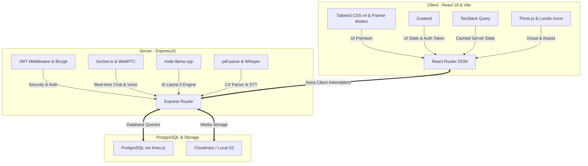
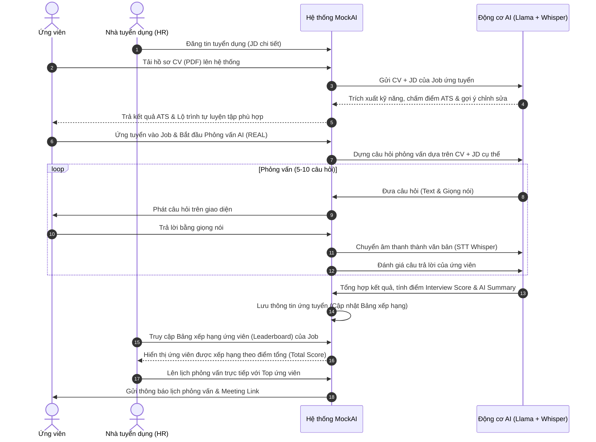
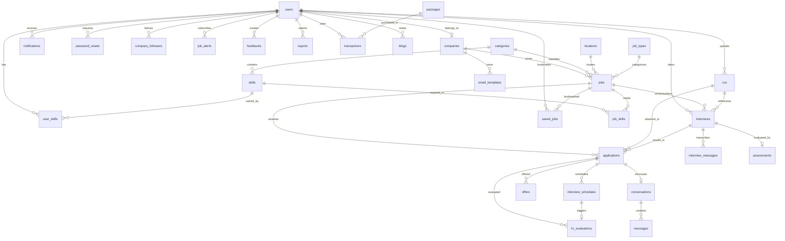

# 🤖 TÀI LIỆU ĐẶC TẢ YÊU CẦU PHẦN MỀM (SRS) - MOCKAI-INTERVIEW

> **Dự án**: Nền tảng Hỗ trợ Việc làm Toàn diện Tích hợp AI (Job Support Platform)
> **Phiên bản**: v1.0.0
> **Ngày cập nhật**: 19/05/2026
> **Tác giả & Đội ngũ thực hiện**: NhaPhuong AI Agent & Dev Team

---

## 📋 MỤC LỤC

- [1. GIỚI THIỆU CHUNG (INTRODUCTION)](#1-giới-thiệu-chung-introduction)
  - [1.1. Mục đích (Purpose)](#11-mục-đích-purpose)
  - [1.2. Phạm vi hệ thống (Scope)](#12-phạm-vi-hệ-thống-scope)
  - [1.3. Thuật ngữ \& Từ viết tắt (Definitions \& Acronyms)](#13-thuật-ngữ--từ-viết-tắt-definitions--acronyms)
- [2. MÔ TẢ TỔNG QUAN (OVERALL DESCRIPTION)](#2-mô-tả-tổng-quan-overall-description)
  - [2.1. Kiến trúc hệ thống (System Architecture)](#21-kiến-trúc-hệ-thống-system-architecture)
  - [2.2. Các tác nhân hệ thống (Actors)](#22-các-tác-nhân-hệ-thống-actors)
  - [2.3. Ngăn xếp công nghệ (Tech Stack)](#23-ngăn-xếp-công-nghệ-tech-stack)
  - [2.4. Sơ đồ luồng hoạt động chính (Core Workflows)](#24-sơ-đồ-luồng-hoạt-động-chính-core-workflows)
- [3. YÊU CẦU CHỨC NĂNG CHI TIẾT (FUNCTIONAL REQUIREMENTS)](#3-yêu-cầu-chức-năng-chi-tiết-functional-requirements)
  - [3.1. Module 1 (Quân): Phỏng vấn kiến thức chuyên môn giữa Ứng viên \& AI (AI Technical Interview)](#31-module-1-quân-phỏng-vấn-kiến-thức-chuyên-môn-giữa-ứng-viên--ai-ai-technical-interview)
  - [3.2. Module 2 (Phương): Luyện tập Phỏng vấn Giọng nói \& Tương tác AI (AI Voice Engine \& Interaction)](#32-module-2-phương-luyện-tập-phỏng-vấn-giọng-nói--tương-tác-ai-ai-voice-engine--interaction)
  - [3.3. Module 3 (Triều): Giao diện \& Chức năng cho HR đăng tuyển (Recruiter Workspace)](#33-module-3-triều-giao-diện--chức-năng-cho-hr-đăng-tuyển-recruiter-workspace)
  - [3.4. Module 4 (Huy): Bộ máy Đánh giá, Chấm điểm \& Gợi ý Chỉnh sửa CV (CV Analyzer \& ATS Optimizer)](#34-module-4-huy-bộ-máy-đánh-giá-chấm-điểm--gợi-y-chỉnh-sửa-cv-cv-analyzer--ats-optimizer)
  - [3.5. Module 5 (Sáng): Quản trị hệ thống toàn diện cho Administrator (Admin System Control)](#35-module-5-sáng-quản-trị-hệ-thống-toàn-diện-cho-administrator-admin-system-control)
- [4. KIẾN TRÚC DỮ LIỆU CHI TIẾT (DATABASE SCHEMA - 31 TABLES)](#4-kiến-trúc-dữ-liệu-chi-tiết-database-schema---31-tables)
  - [4.1. Sơ đồ quan hệ thực thể (ERD - Entity Relationship Diagram)](#41-sơ-đồ-quan-hệ-thực-thể-erd---entity-relationship-diagram)
  - [4.2. Đặc tả chi tiết 31 bảng cơ sở dữ liệu (Database Details)](#42-đặc-tả-chi-tiết-31-bảng-cơ-sở-dữ-liệu-database-details)
- [5. YÊU CẦU PHI CHỨC NĂNG (NON-FUNCTIONAL REQUIREMENTS)](#5-yêu-cầu-phi-chức-năng-non-functional-requirements)
  - [5.1. Tiêu chuẩn bảo mật (Security Armor)](#51-tiêu-chuẩn-bảo-mật-security-armor)
  - [5.2. Hiệu năng \& Tối ưu hóa (Performance \& Vitals)](#52-hiệu-năng--tối-ưu-hóa-performance--vitals)
  - [5.3. Thẩm mỹ giao diện cao cấp (Premium UI/UX - Ocean Blue Style)](#53-thẩm-mỹ-giao-diện-cao-cấp-premium-uiux---ocean-blue-style)
  - [5.4. Tiêu chuẩn Mã nguồn (Code Quality Rules)](#54-tiêu-chuẩn-mã-nguồn-code-quality-rules)

---

## 1. GIỚI THIỆU CHUNG (INTRODUCTION)

### 1.1. Mục đích (Purpose)
Tài liệu Đặc tả Yêu cầu Phần mềm (SRS) này định nghĩa toàn bộ các yêu cầu nghiệp vụ, chức năng, phi chức năng, kiến trúc cơ sở dữ liệu (31 bảng) và quy trình hoạt động của nền tảng **MockAI-Interview**. Tài liệu đóng vai trò là bộ khung tham chiếu chuẩn cho 5 thành viên trong đội ngũ phát triển (Quân, Phương, Huy, Triều, Sáng) nhằm đảm bảo sự thống nhất và chất lượng tối đa trong suốt vòng đời dự án.

### 1.2. Phạm vi hệ thống (Scope)
**MockAI-Interview** không chỉ dừng lại ở một trang tuyển dụng thông thường mà là một hệ sinh thái hỗ trợ việc làm toàn diện tích hợp Trí tuệ nhân tạo (AI):
- **Đối với Ứng viên (Candidate)**: Hỗ trợ tự động phân tích CV, chấm điểm theo tiêu chuẩn ATS, luyện tập phỏng vấn giao tiếp tự do qua giọng nói thực tế (AI Voice Practice), tham gia các kỳ phỏng vấn đánh giá kỹ năng chuyên sâu do doanh nghiệp yêu cầu và nhận báo cáo đánh giá chi tiết (Radar Chart) kèm lộ trình thăng tiến cá nhân hóa.
- **Đối với Nhà tuyển dụng (HR/Recruiter)**: Cung cấp không gian làm việc chuyên nghiệp để đăng bài tuyển dụng, tự động lập danh sách câu hỏi phỏng vấn dựa trên bối cảnh JD & CV ứng viên, đánh giá, xếp hạng ứng viên tự động qua bảng xếp hạng (Leaderboard) được tính toán bởi AI, quản lý lịch phỏng vấn và trao đổi trực tiếp thời gian thực (Real-time Chat).
- **Đối với Quản trị viên (Admin)**: Quản lý tổng thể hệ thống, kiểm duyệt nội dung, xác minh doanh nghiệp, theo dõi báo cáo vi phạm, quản lý gói dịch vụ và các bài viết chia sẻ tri thức (Blog).

### 1.3. Thuật ngữ & Từ viết tắt (Definitions & Acronyms)

| Thuật ngữ | Ý nghĩa giải thích |
| :--- | :--- |
| **ATS** | Applicant Tracking System (Hệ thống quản lý/theo dõi hồ sơ ứng viên, chấm điểm độ phù hợp của CV với mô tả công việc) |
| **JD** | Job Description (Bản mô tả công việc của vị trí ứng tuyển) |
| **STT** | Speech-to-Text (Chuyển đổi giọng nói thành văn bản - Sử dụng Whisper AI) |
| **TTS** | Text-to-Speech (Chuyển đổi văn bản thành giọng nói nhân tạo) |
| **LLM** | Large Language Model (Mô hình ngôn ngữ lớn - Sử dụng Llama 3 cục bộ qua node-llama-cpp) |
| **ERD** | Entity Relationship Diagram (Sơ đồ quan hệ thực thể trong cơ sở dữ liệu) |
| **JWT** | JSON Web Token (Token mã hóa dùng cho xác thực người dùng) |
| **Premium UI** | Phong cách giao diện cao cấp lấy Ocean Blue làm chủ đạo, tích hợp glassmorphism và shadow đa tầng |

---

## 2. MÔ TẢ TỔNG QUAN (OVERALL DESCRIPTION)

### 2.1. Kiến trúc hệ thống (System Architecture)
Hệ thống được thiết kế theo kiến trúc Client-Server hiện đại:
- **Frontend (Client)**: Xây dựng bằng React 19 kết hợp Vite để đạt tốc độ tải trang tối đa. Trạng thái được phân chia nghiêm ngặt: **Zustand** quản lý Client UI State (Modal, Sidebar, Dark Mode, Auth Token) và **TanStack Query** quản lý Server State nhằm tối ưu hóa bộ nhớ đệm và giảm tải request.
- **Backend (Server)**: RESTful API phát triển trên Node.js/Express.js tuân thủ mô hình MVC sạch sẽ. Mọi truy vấn cơ sở dữ liệu thông qua **Knex.js** nhằm tối ưu bảo mật SQL Injection.
- **AI Core**: Tích hợp các thư viện xử lý thông minh trực tiếp trên máy chủ (`node-llama-cpp`, `whisper-node`, `pdf-parse`) giúp bảo mật dữ liệu tuyệt đối và không phát sinh chi phí API bên thứ ba.
- **Real-time Communication**: Kết nối Socket.io cho phép gửi nhận tin nhắn thời gian thực và WebRTC cho việc phỏng vấn video/audio trực tiếp.

### 2.2. Các tác nhân hệ thống (Actors)
1. **Ứng viên (Candidate)**: Người dùng tìm việc, tải CV lên để chấm điểm, luyện tập phỏng vấn giọng nói và ứng tuyển trực tiếp vào các tin tuyển dụng.
2. **Nhà tuyển dụng (HR/Recruiter)**: Đại diện doanh nghiệp, quản lý trang công ty, đăng tin tuyển dụng, xem bảng xếp hạng ứng viên được lọc tự động bởi AI, lên lịch và phỏng vấn ứng viên.
3. **Quản trị viên (Admin)**: Người kiểm duyệt hệ thống, quản lý người dùng, duyệt tin tuyển dụng, xác minh mã số thuế doanh nghiệp, quản trị gói dịch vụ, blogs và xử lý báo cáo vi phạm.

### 2.3. Ngăn xếp công nghệ (Tech Stack)

### 2.4. Sơ đồ luồng hoạt động chính (Core Workflows)
Luồng ứng tuyển và đánh giá ứng viên tự động qua AI:

---

## 3. YÊU CẦU CHỨC NĂNG CHI TIẾT (FUNCTIONAL REQUIREMENTS)

### 3.1. Module 1 (Quân): Phỏng vấn kiến thức chuyên môn giữa Ứng viên & AI (AI Technical Interview)
*   **Mô tả**: Đây là luồng phỏng vấn chính thức (REAL interview) khi ứng viên nộp hồ sơ vào một bài tuyển dụng cụ thể. AI sẽ đóng vai trò người phỏng vấn để kiểm tra kiến thức chuyên môn nhằm lọc ứng viên trước khi gặp HR.
*   **Chức năng chi tiết**:
    1.  **Khởi tạo bộ câu hỏi động**: Hệ thống lấy thông tin CV của ứng viên đã được parse kết hợp với mục `requirements` của bài đăng tuyển dụng (`jobs`) gửi đến mô hình Llama-3 thông qua `node-llama-cpp`. AI sẽ phân tích các khoảng trống kỹ năng để tự sinh câu hỏi thay vì dùng ngân hàng đề cố định.
    2.  **Giao diện phỏng vấn tập trung (Focus Mode)**: Ứng viên tham gia vào một giao diện phỏng vấn chuyên nghiệp, hiển thị trạng thái đang ghi âm/phát và danh sách câu hỏi.
    3.  **Tích hợp Whisper (STT)**: Ứng viên trả lời bằng giọng nói qua micro, hệ thống tự động truyền file âm thanh về backend, gọi thư viện `whisper-node` để convert thành văn bản chính xác theo thời gian thực.
    4.  **Đánh giá & Chấm điểm tự động**: AI đối chiếu câu trả lời văn bản của ứng viên với kiến thức chuẩn của ngành, chấm điểm từng câu và tổng hợp thành `interview_score` (thang điểm 100) và viết một đoạn tóm tắt năng lực (`ai_summary`) cho HR.
    5.  **Bảng xếp hạng ứng viên (Leaderboard)**: Tự động cộng điểm `cv_score` và `interview_score` thành `total_score`, sau đó cập nhật bảng xếp hạng ứng viên của Job ứng tuyển để HR dễ dàng truy cập và lọc hồ sơ.

### 3.2. Module 2 (Phương): Luyện tập Phỏng vấn Giọng nói & Tương tác AI (AI Voice Engine & Interaction)
*   **Mô tả**: Đây là chế độ luyện tập tự do (PRACTICE mode). Giúp ứng viên rèn luyện phản xạ phỏng vấn, vượt qua các vòng Small Talk, đàm phán lương và giới thiệu bản thân bằng âm thanh trực quan.
*   **Chức năng chi tiết**:
    1.  **Lựa chọn chủ đề luyện tập**: Người dùng tự tải CV lên, chọn vị trí muốn giả lập (Frontend Developer, QA, Business Analyst,...) và chọn vòng phỏng vấn (Small Talk, Hành vi/Điểm mạnh yếu, Kỹ thuật cơ bản, Đàm phán lương).
    2.  **Tương tác Real-time Voice (AI Voice Engine)**: Tích hợp Socket.io để truyền tải luồng âm thanh liên tục. Hệ thống sẽ phát giọng nói AI (Text-to-Speech) thân thiện và thu nhận giọng nói của người dùng.
    3.  **Hỗ trợ bật/tắt Camera giả lập**: Giao diện hiển thị cửa sổ webcam cá nhân để người dùng tự điều chỉnh ngôn ngữ cơ thể, biểu cảm khuôn mặt.
    4.  **Lộ trình huấn luyện cá nhân hóa (Coaching Path)**: Kết thúc buổi luyện tập, hệ thống lưu kết quả vào bảng `assessments` dưới dạng JSONB chứa `learning_path`. AI sẽ vạch ra lộ trình chi tiết: chỉ rõ câu trả lời nào chưa tốt, cung cấp văn bản gợi ý trả lời mẫu tối ưu cho từng câu hỏi để ứng viên nâng cao kỹ năng.

### 3.3. Module 3 (Triều): Giao diện & Chức năng cho HR đăng tuyển (Recruiter Workspace)
*   **Mô tả**: Không gian làm việc riêng biệt của HR để quản lý chiến dịch tuyển dụng, sàng lọc ứng viên và thực hiện các bước tiếp theo trong quy trình tuyển dụng thực tế.
*   **Chức năng chi tiết**:
    1.  **Quản lý bài tuyển dụng**: HR tạo, chỉnh sửa tin tuyển dụng với các trường thông tin đầy đủ (title, salary, requirements, skills, location, deadline). Bài đăng sau khi tạo sẽ ở trạng thái `PENDING` chờ Admin duyệt trước khi hiển thị công khai.
    2.  **Sàng lọc ứng viên nâng cao**: HR truy cập vào trang chi tiết của từng Job, xem danh sách ứng viên đã nộp hồ sơ. Danh sách được sắp xếp trực quan theo Bảng xếp hạng điểm số AI (Leaderboard). HR có thể đánh dấu ứng viên bằng thẻ tag (`hr_tag`: POTENTIAL, REJECTED, SHORTLISTED) và ghi chú nội bộ (`hr_notes`).
    3.  **Lên lịch phỏng vấn trực tiếp (Interview Scheduling)**: HR lên lịch phỏng vấn trực tuyến hoặc trực tiếp với những ứng viên vượt qua vòng AI. Hệ thống tự động tạo phòng họp (Google Meet/Zoom) hoặc ghi nhận địa chỉ văn phòng, gửi email/thông báo đồng thời cho cả HR và ứng viên.
    4.  **Đánh giá phỏng vấn trực tiếp (HR Evaluation)**: Sau buổi phỏng vấn trực tiếp, HR ghi nhận kết quả vào hệ thống, đánh giá chi tiết theo 4 tiêu chí: Kỹ thuật (Technical), Giao tiếp (Communication), Mức độ phù hợp văn hóa (Culture Fit) và Điểm tổng quát (Overall), kèm theo đề xuất quyết định (`recommendation`: STRONG_HIRE, HIRE, NO_HIRE).
    5.  **Gửi Thư mời nhận việc (Offer Letter)**: HR tạo và gửi trực tiếp Offer Letter thông qua hệ thống cho ứng viên, thiết lập thời hạn phản hồi, mức lương đề xuất và các phúc lợi đi kèm.
    6.  **Hệ thống chat trực tiếp (Real-time Messaging)**: HR nhắn tin trao đổi trực tiếp với ứng viên qua cổng Socket.io để giải đáp thắc mắc và tương tác nhanh chóng.

### 3.4. Module 4 (Huy): Bộ máy Đánh giá, Chấm điểm & Gợi ý Chỉnh sửa CV (CV Analyzer & ATS Optimizer)
*   **Mô tả**: Cung cấp công cụ phân tích CV đắc lực cho ứng viên, giúp họ tối ưu hóa hồ sơ năng lực trước khi nộp cho nhà tuyển dụng nhằm vượt qua các bộ lọc ATS khắt khe.
*   **Chức năng chi tiết**:
    1.  **Trích xuất thông tin CV thông minh (CV Parser)**: Hỗ trợ ứng viên upload CV định dạng PDF hoặc Docx. Hệ thống sử dụng thư viện `pdf-parse` để quét toàn bộ văn bản thô, trích xuất cấu trúc thông tin (Thông tin cá nhân, Học văn, Kinh nghiệm làm việc, Dự án cá nhân, Kỹ năng).
    2.  **Chấm điểm ATS chuẩn hóa**: Ứng viên có thể nhập link JD công việc mong muốn ứng tuyển. AI sẽ so sánh mức độ tương thích về từ khóa kỹ năng, năm kinh nghiệm, định dạng trình bày và đưa ra điểm số ATS (`ats_score` từ 0 - 100).
    3.  **Nhận xét tổng quan & Gợi ý chỉnh sửa**: AI chỉ ra những điểm yếu của CV (thiếu từ khóa quan trọng của ngành, trình bày quá dài dòng, thiếu số liệu định lượng thành tích) và viết báo cáo chi tiết (`ai_feedback`) gợi ý cách viết lại từng dòng mô tả kinh nghiệm làm việc theo công thức STAR (Situation, Task, Action, Result).
    4.  **Lộ trình phát triển đề xuất**: AI dựa trên khoảng trống kiến thức giữa CV và vị trí ứng tuyển để thiết kế một lộ trình học tập ngắn hạn bao gồm các kỹ năng cần bổ sung gấp.

### 3.5. Module 5 (Sáng): Quản trị hệ thống toàn diện cho Administrator (Admin System Control)
*   **Mô tả**: Bảng điều khiển tối cao của quản trị viên hệ thống để kiểm soát vận hành, đảm bảo an toàn thông tin và xử lý các vấn đề phát sinh của cộng đồng.
*   **Chức năng chi tiết**:
    1.  **Quản lý người dùng (User Management)**: Xem danh sách, tìm kiếm, lọc và phân quyền toàn bộ tài khoản (`users`). Admin có thể khóa (`is_active` = false) các tài khoản vi phạm tiêu chuẩn cộng đồng hoặc có hành vi gian lận.
    2.  **Duyệt tin tuyển dụng (Job Moderation)**: Kiểm duyệt toàn bộ tin tuyển dụng được đăng bởi HR nhằm phòng chống lừa đảo việc làm. Phê duyệt (`approval_status` = APPROVED) hoặc từ chối và ghi rõ lý do.
    3.  **Xác minh doanh nghiệp (Company Verification)**: Xem xét giấy phép kinh doanh, mã số thuế (`tax_code`) của các công ty do HR đăng ký. Đánh dấu tích xanh xác minh (`is_verified` = true) giúp tăng độ uy tín cho nhà tuyển dụng trên nền tảng.
    4.  **Hệ thống xử lý báo cáo vi phạm (Violation Reporting Center)**: Tiếp nhận các báo cáo (`reports`) của người dùng về việc làm lừa đảo, công ty giả mạo hoặc bài viết blog có nội dung không phù hợp. Admin tiến hành điều tra, ra quyết định xử lý (xóa nội dung, cấm tài khoản) và lưu lại biên bản xử lý (`resolution_notes`).
    5.  **Quản trị nội dung & Blog**: Kiểm duyệt bài viết của cộng đồng trước khi xuất bản công khai. Quản lý thư viện mẫu CV (`cv_templates`) chất lượng cao dành cho người dùng.
    6.  **Quản lý Gói dịch vụ & Giao dịch**: Thiết lập các gói dịch vụ dành cho doanh nghiệp (Basic, Pro, Enterprise) với mức giá và giới hạn quyền lợi cụ thể. Theo dõi lịch sử giao dịch nạp tiền, kích hoạt gói tự động khi nhận được thanh toán hợp lệ.

---

## 4. KIẾN TRÚC DỮ LIỆU CHI TIẾT (DATABASE SCHEMA - 31 TABLES)

Cơ sở dữ liệu của dự án sử dụng PostgreSQL và được cấu trúc chặt chẽ gồm **31 bảng**, đảm bảo tính toàn vẹn dữ liệu, hiệu năng truy vấn cao thông qua các chỉ mục (Indexes) được tối ưu hóa.

### 4.1. Sơ đồ quan hệ thực thể (ERD - Entity Relationship Diagram)

### 4.2. Đặc tả chi tiết 31 bảng cơ sở dữ liệu (Database Details)

#### Nhóm 1: Hệ thống Người dùng & Tài khoản (Users & Authentication)

##### 1. Bảng `users` (Thông tin tài khoản chính)
Lưu thông tin định danh và thông tin cá nhân mở rộng của toàn bộ người dùng.
| Tên cột | Kiểu dữ liệu | Ràng buộc | Mô tả |
| :--- | :--- | :--- | :--- |
| `id` | SERIAL | PRIMARY KEY | ID tự tăng |
| `email` | VARCHAR(255) | NOT NULL, UNIQUE | Địa chỉ email đăng nhập |
| `password_hash` | VARCHAR(255) | NOT NULL | Mật khẩu băm (Bcrypt) |
| `full_name` | VARCHAR(255) | NULL | Họ và tên đầy đủ |
| `role` | VARCHAR(50) | NOT NULL (Default: 'USER') | Vai trò: 'USER' (Candidate), 'HR', 'ADMIN' |
| `phone` | VARCHAR(20) | NULL | Số điện thoại liên hệ |
| `avatar_url` | VARCHAR(255) | NULL | Đường dẫn ảnh đại diện |
| `bio` | TEXT | NULL | Tiểu sử ngắn |
| `date_of_birth` | DATE | NULL | Ngày sinh |
| `address` | VARCHAR(255) | NULL | Địa chỉ cư trú |
| `is_active` | BOOLEAN | Default: TRUE | Trạng thái hoạt động tài khoản |
| `email_verified` | BOOLEAN | Default: FALSE | Trạng thái xác thực email |
| `company_id` | INT | FK (references `companies.id`, SET NULL) | Công ty liên kết (chỉ dành cho HR) |
| `created_at` | TIMESTAMP | Default: NOW() | Thời điểm tạo |
| `updated_at` | TIMESTAMP | Default: NOW() | Thời điểm cập nhật gần nhất |

##### 2. Bảng `password_resets` (Mã khôi phục mật khẩu)
Dùng để quản lý mã OTP hoặc Token khôi phục mật khẩu một cách an toàn.
| Tên cột | Kiểu dữ liệu | Ràng buộc | Mô tả |
| :--- | :--- | :--- | :--- |
| `id` | SERIAL | PRIMARY KEY | ID tự tăng |
| `user_id` | INT | FK (references `users.id`, CASCADE), NOT NULL | Tài khoản yêu cầu |
| `token` | VARCHAR(255) | NOT NULL, UNIQUE | Token khôi phục ngẫu nhiên |
| `expires_at` | TIMESTAMP | NOT NULL | Thời gian hết hạn của token |
| `is_used` | BOOLEAN | Default: FALSE | Token đã được sử dụng chưa |
| `created_at` | TIMESTAMP | Default: NOW() | Thời gian yêu cầu |
| `updated_at` | TIMESTAMP | Default: NOW() | Thời gian cập nhật |

---

#### Nhóm 2: Hồ sơ doanh nghiệp & Danh mục dùng chung (Company & Core Catalogs)

##### 3. Bảng `companies` (Hồ sơ Công ty/Doanh nghiệp)
Lưu thông tin doanh nghiệp do HR đăng ký và được Admin duyệt.
| Tên cột | Kiểu dữ liệu | Ràng buộc | Mô tả |
| :--- | :--- | :--- | :--- |
| `id` | SERIAL | PRIMARY KEY | ID tự tăng |
| `name` | VARCHAR(255) | NOT NULL | Tên công ty |
| `logo_url` | VARCHAR(255) | NULL | Đường dẫn logo công ty |
| `website` | VARCHAR(255) | NULL | Website công ty |
| `industry` | VARCHAR(255) | NULL | Lĩnh vực hoạt động chính |
| `company_size` | VARCHAR(50) | NULL | Quy quy mô nhân sự (ví dụ: '11-50', '500+') |
| `description` | TEXT | NULL | Giới thiệu chi tiết công ty |
| `address` | VARCHAR(255) | NULL | Địa chỉ văn phòng chính |
| `phone` | VARCHAR(20) | NULL | Điện thoại hotline |
| `email` | VARCHAR(255) | NULL | Email liên hệ doanh nghiệp |
| `tax_code` | VARCHAR(50) | UNIQUE, NULL | Mã số thuế (dùng để xác minh) |
| `is_verified` | BOOLEAN | Default: FALSE | Tích xanh xác minh doanh nghiệp |
| `created_at` | TIMESTAMP | Default: NOW() | Thời gian khởi tạo |
| `updated_at` | TIMESTAMP | Default: NOW() | Thời gian cập nhật |

##### 4. Bảng `categories` (Danh mục ngành nghề)
Phân loại ngành nghề (ví dụ: Công nghệ thông tin, Thiết kế đồ họa, Quản trị kinh doanh).
| Tên cột | Kiểu dữ liệu | Ràng buộc | Mô tả |
| :--- | :--- | :--- | :--- |
| `id` | SERIAL | PRIMARY KEY | ID tự tăng |
| `name` | VARCHAR(255) | NOT NULL, UNIQUE | Tên danh mục ngành |
| `slug` | VARCHAR(255) | NOT NULL, UNIQUE | Chuỗi slug URL thân thiện |
| `icon` | VARCHAR(255) | NULL | Icon hiển thị trên giao diện |
| `is_active` | BOOLEAN | Default: TRUE | Trạng thái hoạt động |
| `created_at` | TIMESTAMP | Default: NOW() | Thời gian tạo |
| `updated_at` | TIMESTAMP | Default: NOW() | Thời gian cập nhật |

##### 5. Bảng `skills` (Thư viện kỹ năng toàn hệ thống)
Mục lục các kỹ năng chuyên môn (ví dụ: React, Node.js, Python, Figma).
| Tên cột | Kiểu dữ liệu | Ràng buộc | Mô tả |
| :--- | :--- | :--- | :--- |
| `id` | SERIAL | PRIMARY KEY | ID tự tăng |
| `name` | VARCHAR(255) | NOT NULL, UNIQUE | Tên kỹ năng |
| `slug` | VARCHAR(255) | NOT NULL, UNIQUE | Slug URL kỹ năng |
| `category_id` | INT | FK (references `categories.id`, SET NULL) | Thuộc ngành nghề nào |
| `is_active` | BOOLEAN | Default: TRUE | Kỹ năng có sẵn để chọn không |
| `created_at` | TIMESTAMP | Default: NOW() | Thời gian tạo |
| `updated_at` | TIMESTAMP | Default: NOW() | Thời gian cập nhật |

##### 6. Bảng `locations` (Địa điểm làm việc)
Các tỉnh thành/khu vực hỗ trợ tìm việc làm.
| Tên cột | Kiểu dữ liệu | Ràng buộc | Mô tả |
| :--- | :--- | :--- | :--- |
| `id` | SERIAL | PRIMARY KEY | ID tự tăng |
| `name` | VARCHAR(255) | NOT NULL | Tên địa điểm (ví dụ: 'Hồ Chí Minh') |
| `slug` | VARCHAR(255) | NOT NULL, UNIQUE | Slug địa danh |
| `region` | VARCHAR(50) | NULL | Miền Bắc, Miền Trung, Miền Nam |
| `is_active` | BOOLEAN | Default: TRUE | Trạng thái khả dụng |
| `created_at` | TIMESTAMP | Default: NOW() | Thời gian tạo |
| `updated_at` | TIMESTAMP | Default: NOW() | Thời gian cập nhật |

##### 7. Bảng `job_types` (Hình thức làm việc)
Các hình thức tuyển dụng phổ biến.
| Tên cột | Kiểu dữ liệu | Ràng buộc | Mô tả |
| :--- | :--- | :--- | :--- |
| `id` | SERIAL | PRIMARY KEY | ID tự tăng |
| `name` | VARCHAR(255) | NOT NULL, UNIQUE | Ví dụ: Full-time, Part-time, Remote, Internship |
| `slug` | VARCHAR(255) | NOT NULL, UNIQUE | Slug hình thức |
| `is_active` | BOOLEAN | Default: TRUE | Trạng thái khả dụng |
| `created_at` | TIMESTAMP | Default: NOW() | Thời gian tạo |
| `updated_at` | TIMESTAMP | Default: NOW() | Thời gian cập nhật |

---

#### Nhóm 3: Quan hệ Kỹ năng & Hồ sơ tuyển dụng (Job Postings & Skills Junctions)

##### 8. Bảng `jobs` (Bài tuyển dụng chi tiết)
Thông tin các tin tuyển dụng do HR đăng và được Admin duyệt.
| Tên cột | Kiểu dữ liệu | Ràng buộc | Mô tả |
| :--- | :--- | :--- | :--- |
| `id` | SERIAL | PRIMARY KEY | ID tự tăng |
| `hr_id` | INT | FK (references `users.id`, CASCADE) | HR tạo tin |
| `company_id` | INT | FK (references `companies.id`, CASCADE) | Công ty tuyển dụng |
| `category_id` | INT | FK (references `categories.id`, SET NULL) | Danh mục ngành nghề |
| `location_id` | INT | FK (references `locations.id`, SET NULL) | Địa điểm làm việc |
| `job_type_id` | INT | FK (references `job_types.id`, SET NULL) | Hình thức làm việc |
| `title` | VARCHAR(255) | NOT NULL | Tiêu đề tin tuyển dụng |
| `description` | TEXT | NULL | Mô tả công việc chi tiết |
| `requirements` | TEXT | NULL | Yêu cầu công việc (AI dùng để đặt câu hỏi phỏng vấn) |
| `experience_level` | VARCHAR(50) | NULL | Cấp bậc: 'INTERN', 'JUNIOR', 'MID', 'SENIOR', 'LEAD' |
| `salary_min` | DECIMAL(14,2) | NULL | Lương tối thiểu |
| `salary_max` | DECIMAL(14,2) | NULL | Lương tối đa |
| `salary_currency` | VARCHAR(10) | Default: 'VND' | Loại tiền tệ thanh toán lương |
| `is_salary_visible` | BOOLEAN | Default: TRUE | Công khai mức lương không |
| `vacancy_count` | INT | Default: 1 | Số lượng tuyển dụng |
| `deadline` | TIMESTAMP | NULL | Hạn nộp hồ sơ |
| `status` | VARCHAR(50) | Default: 'OPEN' | Trạng thái: 'OPEN', 'CLOSED' |
| `approval_status` | VARCHAR(50) | Default: 'PENDING' | Trạng thái duyệt: 'PENDING', 'APPROVED', 'REJECTED' |
| `approved_by` | INT | FK (references `users.id`, SET NULL) | Admin thực hiện duyệt bài |
| `approved_at` | TIMESTAMP | NULL | Thời điểm duyệt bài |
| `view_count` | INT | Default: 0 | Số lượt xem bài đăng |
| `created_at` | TIMESTAMP | Default: NOW() | Thời gian tạo tin |
| `updated_at` | TIMESTAMP | Default: NOW() | Thời gian cập nhật tin |

##### 9. Bảng `job_skills` (Bảng trung gian Kỹ năng Yêu cầu của Job - Quan hệ N-N)
Xác định danh sách các kỹ năng bắt buộc/ưu tiên của tin tuyển dụng.
| Tên cột | Kiểu dữ liệu | Ràng buộc | Mô tả |
| :--- | :--- | :--- | :--- |
| `id` | SERIAL | PRIMARY KEY | ID tự tăng |
| `job_id` | INT | FK (references `jobs.id`, CASCADE), UNIQUE(job_id, skill_id) | Liên kết tin tuyển dụng |
| `skill_id` | INT | FK (references `skills.id`, CASCADE) | Liên kết kỹ năng |
| `created_at` | TIMESTAMP | Default: NOW() | Thời gian liên kết |
| `updated_at` | TIMESTAMP | Default: NOW() | Thời gian cập nhật |

##### 10. Bảng `user_skills` (Bảng trung gian Kỹ năng Ứng viên sở hữu - Quan hệ N-N)
Lưu trữ danh sách kỹ năng chuyên môn của ứng viên kèm theo trình độ và số năm kinh nghiệm.
| Tên cột | Kiểu dữ liệu | Ràng buộc | Mô tả |
| :--- | :--- | :--- | :--- |
| `id` | SERIAL | PRIMARY KEY | ID tự tăng |
| `user_id` | INT | FK (references `users.id`, CASCADE), UNIQUE(user_id, skill_id) | Liên kết ứng viên |
| `skill_id` | INT | FK (references `skills.id`, CASCADE) | Liên kết kỹ năng |
| `proficiency_level` | VARCHAR(50) | NULL | Trình độ: 'BEGINNER', 'INTERMEDIATE', 'ADVANCED', 'EXPERT' |
| `years_of_experience` | INT | NULL | Số năm làm việc thực tế với kỹ năng này |
| `created_at` | TIMESTAMP | Default: NOW() | Thời gian khai báo |
| `updated_at` | TIMESTAMP | Default: NOW() | Thời gian cập nhật |

---

#### Nhóm 4: Phân tích CV & Giả lập Phỏng vấn AI (CV Extraction & AI Interview Engine)

##### 11. Bảng `cvs` (Thông tin CV ứng viên)
Quản lý các file CV ứng viên tải lên cùng kết quả phân tích sơ bộ của AI.
| Tên cột | Kiểu dữ liệu | Ràng buộc | Mô tả |
| :--- | :--- | :--- | :--- |
| `id` | SERIAL | PRIMARY KEY | ID tự tăng |
| `user_id` | INT | FK (references `users.id`, CASCADE), NOT NULL | Ứng viên sở hữu CV |
| `file_url` | VARCHAR(255) | NULL | Đường dẫn file CV lưu trên máy chủ (PDF/Docx) |
| `parsed_text` | TEXT | NULL | Văn bản thô được trích xuất (bằng pdf-parse) |
| `ats_score` | INT | NULL | Điểm tương thích ATS tự động chấm (thang điểm 100) |
| `ai_feedback` | TEXT | NULL | Nhận xét tổng quan và gợi ý sửa đổi chi tiết từ AI |
| `created_at` | TIMESTAMP | Default: NOW() | Thời điểm tải lên |
| `updated_at` | TIMESTAMP | Default: NOW() | Thời điểm cập nhật |

##### 12. Bảng `interviews` (Phiên phỏng vấn/luyện tập AI)
Ghi nhận một phiên phỏng vấn chính thức (REAL) hoặc luyện tập giao tiếp giọng nói tự do (PRACTICE).
| Tên cột | Kiểu dữ liệu | Ràng buộc | Mô tả |
| :--- | :--- | :--- | :--- |
| `id` | SERIAL | PRIMARY KEY | ID tự tăng |
| `user_id` | INT | FK (references `users.id`, CASCADE), NOT NULL | Ứng viên tham gia |
| `cv_id` | INT | FK (references `cvs.id`, SET NULL) | CV sử dụng làm bối cảnh phỏng vấn |
| `job_id` | INT | FK (references `jobs.id`, SET NULL) | Job ứng tuyển (bắt buộc đối với REAL) |
| `type` | VARCHAR(50) | NOT NULL (Default: 'PRACTICE') | Loại phỏng vấn: 'PRACTICE', 'REAL' |
| `status` | VARCHAR(50) | Default: 'PENDING' | Trạng thái: 'PENDING', 'IN_PROGRESS', 'COMPLETED' |
| `started_at` | TIMESTAMP | NULL | Thời gian bắt đầu phiên |
| `ended_at` | TIMESTAMP | NULL | Thời gian kết thúc phiên |
| `created_at` | TIMESTAMP | Default: NOW() | Thời điểm tạo phiên |
| `updated_at` | TIMESTAMP | Default: NOW() | Thời điểm cập nhật |

##### 13. Bảng `interview_messages` (Nhật ký hội thoại phỏng vấn AI)
Lưu trữ toàn bộ nội dung trao đổi qua lại giữa AI và ứng viên trong phòng phỏng vấn.
| Tên cột | Kiểu dữ liệu | Ràng buộc | Mô tả |
| :--- | :--- | :--- | :--- |
| `id` | SERIAL | PRIMARY KEY | ID tự tăng |
| `interview_id` | INT | FK (references `interviews.id`, CASCADE), NOT NULL | Phiên phỏng vấn thuộc về |
| `role` | VARCHAR(50) | NOT NULL | Người nói: 'USER' (Ứng viên), 'AI' |
| `content` | TEXT | NOT NULL | Nội dung văn bản trao đổi (sau khi STT đối với âm thanh) |
| `created_at` | TIMESTAMP | Default: NOW() | Thời điểm nói |
| `updated_at` | TIMESTAMP | Default: NOW() | Thời điểm cập nhật |

##### 14. Bảng `assessments` (Báo cáo đánh giá năng lực AI)
Báo cáo chuyên sâu được AI tự động sinh sau khi phiên phỏng vấn kết thúc.
| Tên cột | Kiểu dữ liệu | Ràng buộc | Mô tả |
| :--- | :--- | :--- | :--- |
| `id` | SERIAL | PRIMARY KEY | ID tự tăng |
| `interview_id` | INT | FK (references `interviews.id`, CASCADE), UNIQUE, NOT NULL | Phiên phỏng vấn liên kết |
| `overall_score` | INT | NULL | Điểm tổng quát (thang điểm 100) |
| `feedback_summary` | TEXT | NULL | Đánh giá tổng quan năng lực ứng viên |
| `learning_path` | JSONB | NULL | Lộ trình ôn luyện đề xuất từ AI dạng sơ đồ JSON |
| `created_at` | TIMESTAMP | Default: NOW() | Thời điểm xuất báo cáo |
| `updated_at` | TIMESTAMP | Default: NOW() | Thời điểm cập nhật |

---

#### Nhóm 5: Quy trình Tuyển dụng & Quản lý Ứng viên (Application Workflow & HR Actions)

##### 15. Bảng `applications` (Đơn ứng tuyển của Candidate)
Bảng trung tâm liên kết ứng viên với vị trí ứng tuyển của doanh nghiệp.
| Tên cột | Kiểu dữ liệu | Ràng buộc | Mô tả |
| :--- | :--- | :--- | :--- |
| `id` | SERIAL | PRIMARY KEY | ID tự tăng |
| `candidate_id` | INT | FK (references `users.id`, CASCADE), NOT NULL, UNIQUE(candidate_id, job_id) | Ứng viên ứng tuyển |
| `job_id` | INT | FK (references `jobs.id`, CASCADE), NOT NULL | Vị trí công việc ứng tuyển |
| `cv_id` | INT | FK (references `cvs.id`, SET NULL) | CV sử dụng để nộp hồ sơ |
| `interview_id` | INT | FK (references `interviews.id`, SET NULL) | Phiên phỏng vấn AI (REAL) liên kết |
| `status` | VARCHAR(50) | Default: 'SUBMITTED' | Quy trình: 'SUBMITTED' -> 'AI_INTERVIEW' -> 'AI_REVIEWED' -> 'HR_REVIEWING' -> 'SHORTLISTED' -> 'INTERVIEW_SCHEDULED' -> 'HIRED' / 'REJECTED' |
| `cv_score` | INT | NULL | Điểm đánh giá độ phù hợp CV của AI |
| `interview_score` | INT | NULL | Điểm đánh giá phỏng vấn AI |
| `total_score` | INT | NULL | Điểm xếp hạng tổng hợp (CV + Interview) |
| `ai_summary` | TEXT | NULL | Tóm tắt thế mạnh/điểm yếu của ứng viên do AI viết cho HR |
| `hr_tag` | VARCHAR(50) | NULL | Phân loại của HR: 'POTENTIAL', 'SHORTLISTED', 'LATER', 'REJECTED' |
| `hr_notes` | TEXT | NULL | Ghi chú nội bộ của HR về ứng viên |
| `reviewed_by` | INT | FK (references `users.id`, SET NULL) | HR trực tiếp phụ trách đánh giá hồ sơ |
| `reviewed_at` | TIMESTAMP | NULL | Thời điểm HR bắt đầu xem xét hồ sơ |
| `cover_letter` | TEXT | NULL | Thư xin việc (tùy chọn) |
| `created_at` | TIMESTAMP | Default: NOW() | Ngày nộp hồ sơ |
| `updated_at` | TIMESTAMP | Default: NOW() | Ngày cập nhật trạng thái gần nhất |

**Chỉ mục tối ưu hóa hiệu năng (Indexes):**
- Chỉ mục `idx_applications_leaderboard` trên các cột (`job_id`, `total_score` DESC) dùng để tăng tốc độ hiển thị Bảng xếp hạng ứng viên của HR.
- Chỉ mục `idx_applications_candidate` trên các cột (`candidate_id`, `status`) dùng để tối ưu giao diện theo dõi lịch sử ứng tuyển của Ứng viên.

##### 16. Bảng `interview_schedules` (Lịch phỏng vấn trực tiếp với HR)
Lịch hẹn gặp mặt phỏng vấn thật do HR chủ động thiết lập.
| Tên cột | Kiểu dữ liệu | Ràng buộc | Mô tả |
| :--- | :--- | :--- | :--- |
| `id` | SERIAL | PRIMARY KEY | ID tự tăng |
| `application_id` | INT | FK (references `applications.id`, CASCADE), NOT NULL | Hồ sơ ứng tuyển liên kết |
| `scheduled_by` | INT | FK (references `users.id`, CASCADE), NOT NULL | HR đặt lịch |
| `candidate_id` | INT | FK (references `users.id`, CASCADE), NOT NULL | Ứng viên được mời phỏng vấn |
| `title` | VARCHAR(255) | NOT NULL | Tiêu đề cuộc hẹn (ví dụ: 'Phỏng vấn chuyên sâu kỹ thuật Vòng 2') |
| `scheduled_at` | TIMESTAMP | NOT NULL | Ngày giờ diễn ra cuộc phỏng vấn |
| `duration_minutes` | INT | Default: 60 | Thời lượng dự kiến (phút) |
| `format` | VARCHAR(50) | Default: 'ONLINE' | Hình thức: 'ONLINE', 'OFFLINE' |
| `meeting_link` | VARCHAR(255) | NULL | Đường dẫn Google Meet/Zoom nếu phỏng vấn ONLINE |
| `location` | VARCHAR(255) | NULL | Địa chỉ chi nhánh nếu phỏng vấn OFFLINE |
| `notes` | TEXT | NULL | Hướng dẫn ứng viên chuẩn bị |
| `status` | VARCHAR(50) | Default: 'PENDING' | Trạng thái lịch: 'PENDING', 'CONFIRMED', 'COMPLETED', 'CANCELLED' |
| `cancel_reason` | TEXT | NULL | Lý do hủy hẹn (nếu có) |
| `created_at` | TIMESTAMP | Default: NOW() | Ngày hẹn lịch |
| `updated_at` | TIMESTAMP | Default: NOW() | Ngày cập nhật lịch |

##### 17. Bảng `hr_evaluations` (HR đánh giá ứng viên sau phỏng vấn thật)
Ghi nhận biên bản đánh giá sau buổi phỏng vấn trực tiếp của HR với ứng viên.
| Tên cột | Kiểu dữ liệu | Ràng buộc | Mô tả |
| :--- | :--- | :--- | :--- |
| `id` | SERIAL | PRIMARY KEY | ID tự tăng |
| `application_id` | INT | FK (references `applications.id`, CASCADE), NOT NULL | Đơn ứng tuyển liên kết |
| `schedule_id` | INT | FK (references `interview_schedules.id`, SET NULL) | Cuộc phỏng vấn cụ thể |
| `evaluator_id` | INT | FK (references `users.id`, CASCADE), NOT NULL | HR đánh giá trực tiếp |
| `round` | VARCHAR(100) | NOT NULL | Vòng phỏng vấn (ví dụ: 'Vòng Kỹ thuật 1', 'Phỏng vấn Văn hóa') |
| `technical_score` | INT | NULL | Điểm kỹ thuật (thang điểm 10) |
| `communication_score`| INT | NULL | Điểm giao tiếp (thang điểm 10) |
| `culture_fit_score` | INT | NULL | Điểm phù hợp văn hóa công ty (thang điểm 10) |
| `overall_score` | INT | NULL | Điểm tổng quát (thang điểm 10) |
| `strengths` | TEXT | NULL | Ưu điểm nổi bật của ứng viên |
| `weaknesses` | TEXT | NULL | Khuyết điểm cần cải thiện |
| `comments` | TEXT | NULL | Nhận xét chung |
| `recommendation` | VARCHAR(100) | Default: 'PENDING' | Đề xuất: 'STRONG_HIRE', 'HIRE', 'NO_HIRE', 'STRONG_NO_HIRE', 'PENDING' |
| `created_at` | TIMESTAMP | Default: NOW() | Ngày tạo đánh giá |
| `updated_at` | TIMESTAMP | Default: NOW() | Ngày cập nhật |

##### 18. Bảng `offers` (Thư mời nhận việc từ HR)
Quản lý quy trình gửi và phản hồi Offer Letter của hai bên.
| Tên cột | Kiểu dữ liệu | Ràng buộc | Mô tả |
| :--- | :--- | :--- | :--- |
| `id` | SERIAL | PRIMARY KEY | ID tự tăng |
| `application_id` | INT | FK (references `applications.id`, CASCADE), NOT NULL | Hồ sơ ứng tuyển liên quan |
| `sent_by` | INT | FK (references `users.id`, CASCADE), NOT NULL | HR gửi thư mời |
| `candidate_id` | INT | FK (references `users.id`, CASCADE), NOT NULL | Ứng viên nhận thư mời |
| `position` | VARCHAR(255) | NOT NULL | Vị trí công việc đề xuất |
| `offered_salary` | DECIMAL(14,2) | NULL | Mức lương đề xuất |
| `salary_currency` | VARCHAR(10) | Default: 'VND' | Đơn vị tiền tệ lương |
| `start_date` | DATE | NULL | Ngày dự kiến nhận việc |
| `benefits` | TEXT | NULL | Mô tả các chế độ phúc lợi kèm theo |
| `additional_terms` | TEXT | NULL | Điều khoản cam kết khác |
| `status` | VARCHAR(50) | Default: 'SENT' | Trạng thái: 'SENT', 'VIEWED', 'ACCEPTED', 'REJECTED', 'EXPIRED' |
| `expires_at` | TIMESTAMP | NULL | Thời hạn tối đa để phản hồi offer |
| `responded_at` | TIMESTAMP | NULL | Ngày ứng viên bấm trả lời chấp nhận/từ chối |
| `reject_reason` | TEXT | NULL | Lý do ứng viên từ chối nhận việc (nếu có) |
| `created_at` | TIMESTAMP | Default: NOW() | Ngày gửi |
| `updated_at` | TIMESTAMP | Default: NOW() | Ngày cập nhật |

##### 19. Bảng `email_templates` (Mẫu email của HR soạn thảo)
Quản lý các email gửi tự động cho ứng viên (cám ơn, mời phỏng vấn, từ chối).
| Tên cột | Kiểu dữ liệu | Ràng buộc | Mô tả |
| :--- | :--- | :--- | :--- |
| `id` | SERIAL | PRIMARY KEY | ID tự tăng |
| `company_id` | INT | FK (references `companies.id`, CASCADE) | Thuộc công ty nào sở hữu |
| `name` | VARCHAR(255) | NOT NULL | Tên mẫu thư (ví dụ: 'Thư mời Test AI') |
| `type` | VARCHAR(50) | NOT NULL | Loại email: 'THANK_YOU', 'REJECTION', 'OFFER', 'INTERVIEW_INVITE', 'CUSTOM' |
| `subject` | VARCHAR(255) | NOT NULL | Tiêu đề mặc định của email gửi đi |
| `body` | TEXT | NOT NULL | Nội dung email (hỗ trợ placeholder động dạng `{{candidate_name}}`) |
| `is_default` | BOOLEAN | Default: FALSE | Có phải là mẫu mặc định của hệ thống không |
| `created_at` | TIMESTAMP | Default: NOW() | Ngày tạo |
| `updated_at` | TIMESTAMP | Default: NOW() | Ngày cập nhật |

---

#### Nhóm 6: Hệ thống Trò chuyện thời gian thực & Tương tác (Real-time Messaging & Interactions)

##### 20. Bảng `conversations` (Cuộc hội thoại Chat giữa HR & Ứng viên)
Kênh kết nối bảo mật giữa Ứng viên và HR phụ trách.
| Tên cột | Kiểu dữ liệu | Ràng buộc | Mô tả |
| :--- | :--- | :--- | :--- |
| `id` | SERIAL | PRIMARY KEY | ID tự tăng |
| `participant_one` | INT | FK (references `users.id`, CASCADE), NOT NULL, UNIQUE(participant_one, participant_two) | Người tham gia thứ nhất (thường là HR) |
| `participant_two` | INT | FK (references `users.id`, CASCADE), NOT NULL | Người tham gia thứ hai (thường là Ứng viên) |
| `application_id` | INT | FK (references `applications.id`, SET NULL) | Bối cảnh đơn ứng tuyển liên quan (tùy chọn) |
| `last_message_at` | TIMESTAMP | NULL | Thời điểm tin nhắn cuối cùng để sắp xếp cuộc hội thoại lên đầu |
| `created_at` | TIMESTAMP | Default: NOW() | Ngày tạo kênh |
| `updated_at` | TIMESTAMP | Default: NOW() | Ngày cập nhật |

##### 21. Bảng `messages` (Nội dung tin nhắn chi tiết)
Nội dung trao đổi chi tiết trong kênh hội thoại thời gian thực qua Socket.io.
| Tên cột | Kiểu dữ liệu | Ràng buộc | Mô tả |
| :--- | :--- | :--- | :--- |
| `id` | SERIAL | PRIMARY KEY | ID tự tăng |
| `conversation_id` | INT | FK (references `conversations.id`, CASCADE), NOT NULL | Thuộc cuộc hội thoại nào |
| `sender_id` | INT | FK (references `users.id`, CASCADE), NOT NULL | Người gửi tin nhắn |
| `content` | TEXT | NOT NULL | Nội dung tin nhắn văn bản |
| `type` | VARCHAR(50) | Default: 'TEXT' | Loại tin nhắn: 'TEXT', 'FILE', 'IMAGE' |
| `file_url` | VARCHAR(255) | NULL | Link file đính kèm nếu gửi hình ảnh hoặc tài liệu |
| `is_read` | BOOLEAN | Default: FALSE | Đã đọc chưa |
| `read_at` | TIMESTAMP | NULL | Thời điểm đối phương đọc tin nhắn |
| `created_at` | TIMESTAMP | Default: NOW() | Thời gian gửi |
| `updated_at` | TIMESTAMP | Default: NOW() | Thời gian cập nhật |

---

#### Nhóm 7: Tương tác Ứng viên & Thông báo (Candidate Engagement & Notifications)

##### 22. Bảng `saved_jobs` (Danh sách Job đã lưu)
Cho phép ứng viên đánh dấu, bookmark các công việc quan tâm để ứng tuyển sau.
| Tên cột | Kiểu dữ liệu | Ràng buộc | Mô tả |
| :--- | :--- | :--- | :--- |
| `id` | SERIAL | PRIMARY KEY | ID tự tăng |
| `user_id` | INT | FK (references `users.id`, CASCADE), UNIQUE(user_id, job_id), NOT NULL | Ứng viên lưu |
| `job_id` | INT | FK (references `jobs.id`, CASCADE), NOT NULL | Job được lưu |
| `created_at` | TIMESTAMP | Default: NOW() | Ngày lưu |
| `updated_at` | TIMESTAMP | Default: NOW() | Ngày cập nhật |

##### 23. Bảng `company_followers` (Ứng viên theo dõi Công ty)
Nhận cập nhật về tin tuyển dụng mới từ doanh nghiệp yêu thích.
| Tên cột | Kiểu dữ liệu | Ràng buộc | Mô tả |
| :--- | :--- | :--- | :--- |
| `id` | SERIAL | PRIMARY KEY | ID tự tăng |
| `user_id` | INT | FK (references `users.id`, CASCADE), UNIQUE(user_id, company_id), NOT NULL | Ứng viên theo dõi |
| `company_id` | INT | FK (references `companies.id`, CASCADE), NOT NULL | Công ty được theo dõi |
| `created_at` | TIMESTAMP | Default: NOW() | Ngày bấm theo dõi |
| `updated_at` | TIMESTAMP | Default: NOW() | Ngày cập nhật |

##### 24. Bảng `job_alerts` (Đăng ký nhận bản tin việc làm tự động)
Gửi email gợi ý việc làm định kỳ phù hợp với từ khóa và mức lương mong muốn.
| Tên cột | Kiểu dữ liệu | Ràng buộc | Mô tả |
| :--- | :--- | :--- | :--- |
| `id` | SERIAL | PRIMARY KEY | ID tự tăng |
| `user_id` | INT | FK (references `users.id`, CASCADE), NOT NULL | Ứng viên đăng ký |
| `keyword` | VARCHAR(255) | NULL | Từ khóa vị trí công việc quan tâm (ví dụ: 'React') |
| `category_id` | INT | FK (references `categories.id`, SET NULL) | Ngành nghề quan tâm |
| `location_id` | INT | FK (references `locations.id`, SET NULL) | Địa điểm mong muốn |
| `job_type_id` | INT | FK (references `job_types.id`, SET NULL) | Hình thức làm việc mong muốn |
| `experience_level` | VARCHAR(50) | NULL | Cấp bậc mong muốn |
| `salary_min` | DECIMAL(14,2) | NULL | Lương tối thiểu kỳ vọng |
| `frequency` | VARCHAR(50) | Default: 'DAILY' | Tần suất nhận email: 'INSTANT', 'DAILY', 'WEEKLY' |
| `is_active` | BOOLEAN | Default: TRUE | Trạng thái nhận tin |
| `created_at` | TIMESTAMP | Default: NOW() | Ngày tạo bản tin |
| `updated_at` | TIMESTAMP | Default: NOW() | Ngày cập nhật |

##### 25. Bảng `notifications` (Hệ thống Thông báo Trung tâm)
Trung tâm hiển thị thông báo tức thời của hệ thống cho tất cả tác nhân.
| Tên cột | Kiểu dữ liệu | Ràng buộc | Mô tả |
| :--- | :--- | :--- | :--- |
| `id` | SERIAL | PRIMARY KEY | ID tự tăng |
| `user_id` | INT | FK (references `users.id`, CASCADE), NOT NULL | Người nhận thông báo |
| `type` | VARCHAR(100) | NOT NULL | Loại: 'JOB_ALERT', 'APPLICATION_UPDATE', 'INTERVIEW_INVITE', 'CV_REVIEWED', 'NEW_MESSAGE' |
| `title` | VARCHAR(255) | NOT NULL | Tiêu đề thông báo |
| `content` | TEXT | NULL | Nội dung tóm tắt thông báo |
| `link` | VARCHAR(255) | NULL | Đường dẫn chuyển trang trực tiếp khi nhấp chuột |
| `reference_id` | INT | NULL | ID của đối tượng liên quan (ví dụ: `job_id`, `application_id`) |
| `reference_type` | VARCHAR(100) | NULL | Kiểu đối tượng: 'job', 'application', 'interview' |
| `is_read` | BOOLEAN | Default: FALSE | Đã đọc hay chưa |
| `read_at` | TIMESTAMP | NULL | Thời điểm đọc thông báo |
| `created_at` | TIMESTAMP | Default: NOW() | Ngày tạo |
| `updated_at` | TIMESTAMP | Default: NOW() | Ngày cập nhật |

---

#### Nhóm 8: Quản trị Nội dung, Biểu mẫu & Đóng góp ý kiến (Content Management, Templates & Feedbacks)

##### 26. Bảng `cv_templates` (Mẫu CV do Admin Quản lý)
Thư viện mẫu CV do quản trị viên thiết kế sẵn để người dùng lựa chọn.
| Tên cột | Kiểu dữ liệu | Ràng buộc | Mô tả |
| :--- | :--- | :--- | :--- |
| `id` | SERIAL | PRIMARY KEY | ID tự tăng |
| `name` | VARCHAR(255) | NOT NULL | Tên mẫu CV (ví dụ: 'Mẫu IT chuyên nghiệp') |
| `thumbnail_url` | VARCHAR(255) | NULL | Ảnh xem trước mẫu CV |
| `html_structure` | TEXT | NULL | Cấu trúc HTML/JSON mẫu để hiển thị chỉnh sửa trực tuyến |
| `category` | VARCHAR(100) | NULL | Nhóm ngành áp dụng tốt nhất |
| `is_premium` | BOOLEAN | Default: FALSE | Có yêu cầu tài khoản nâng cấp không |
| `is_active` | BOOLEAN | Default: TRUE | Trạng thái khả dụng |
| `usage_count` | INT | Default: 0 | Số lượt người dùng đã áp dụng mẫu này |
| `created_by` | INT | FK (references `users.id`, SET NULL) | Admin tạo biểu mẫu |
| `created_at` | TIMESTAMP | Default: NOW() | Ngày tạo |
| `updated_at` | TIMESTAMP | Default: NOW() | Ngày cập nhật |

##### 27. Bảng `blogs` (Bài viết chia sẻ cộng đồng / Cẩm nang nghề nghiệp)
Kênh chia sẻ cẩm nang tuyển dụng và kiến thức việc làm.
| Tên cột | Kiểu dữ liệu | Ràng buộc | Mô tả |
| :--- | :--- | :--- | :--- |
| `id` | SERIAL | PRIMARY KEY | ID tự tăng |
| `author_id` | INT | FK (references `users.id`, CASCADE), NOT NULL | Tác giả bài viết |
| `title` | VARCHAR(255) | NOT NULL | Tiêu đề bài viết |
| `slug` | VARCHAR(255) | NOT NULL, UNIQUE | Slug URL bài viết |
| `content` | TEXT | NOT NULL | Nội dung chi tiết (hỗ trợ định dạng Markdown/HTML) |
| `cover_image_url` | VARCHAR(255) | NULL | Ảnh bìa bài viết |
| `category` | VARCHAR(100) | NULL | Danh mục bài viết (ví dụ: 'Career Tips', 'Interview Guide') |
| `tags` | TEXT[] | NULL | Mảng nhãn tìm kiếm mở rộng (PostgreSQL Array) |
| `status` | VARCHAR(50) | Default: 'DRAFT' | Trạng thái: 'DRAFT', 'PENDING' (chờ duyệt), 'PUBLISHED', 'REJECTED' |
| `reject_reason` | TEXT | NULL | Lý do Admin từ chối phê duyệt xuất bản |
| `approved_by` | INT | FK (references `users.id`, SET NULL) | Admin duyệt bài viết |
| `published_at` | TIMESTAMP | NULL | Thời điểm chính thức xuất bản bài viết |
| `view_count` | INT | Default: 0 | Tổng số lượt đọc bài viết |
| `created_at` | TIMESTAMP | Default: NOW() | Ngày viết |
| `updated_at` | TIMESTAMP | Default: NOW() | Ngày cập nhật gần nhất |

##### 28. Bảng `feedbacks` (Đóng góp ý kiến của người dùng)
Ghi nhận các ý kiến đóng góp nhằm liên tục cải tiến hệ thống.
| Tên cột | Kiểu dữ liệu | Ràng buộc | Mô tả |
| :--- | :--- | :--- | :--- |
| `id` | SERIAL | PRIMARY KEY | ID tự tăng |
| `user_id` | INT | FK (references `users.id`, CASCADE), NOT NULL | Người dùng đóng góp |
| `subject` | VARCHAR(255) | NOT NULL | Chủ đề ý kiến đóng góp |
| `content` | TEXT | NOT NULL | Nội dung chi tiết đóng góp ý kiến |
| `category` | VARCHAR(100) | NULL | Phân loại: 'BUG' (Báo lỗi), 'FEATURE_REQUEST', 'UI_UX', 'OTHER' |
| `rating` | INT | NULL | Điểm khảo sát độ hài lòng (1 - 5) |
| `status` | VARCHAR(50) | Default: 'OPEN' | Trạng thái: 'OPEN', 'REVIEWING', 'RESOLVED', 'CLOSED' |
| `admin_response` | TEXT | NULL | Phản hồi chính thức từ quản trị viên |
| `responded_by` | INT | FK (references `users.id`, SET NULL) | Admin phụ trách phản hồi |
| `created_at` | TIMESTAMP | Default: NOW() | Ngày gửi |
| `updated_at` | TIMESTAMP | Default: NOW() | Ngày cập nhật |

##### 29. Bảng `reports` (Báo cáo vi phạm)
Hệ thống báo cáo vi phạm nội dung không lành mạnh trên nền tảng.
| Tên cột | Kiểu dữ liệu | Ràng buộc | Mô tả |
| :--- | :--- | :--- | :--- |
| `id` | SERIAL | PRIMARY KEY | ID tự tăng |
| `reporter_id` | INT | FK (references `users.id`, CASCADE), NOT NULL | Người báo cáo vi phạm |
| `target_type` | VARCHAR(50) | NOT NULL | Đối tượng bị báo cáo: 'USER', 'JOB', 'BLOG', 'COMPANY' |
| `target_id` | INT | NOT NULL | ID cụ thể của đối tượng bị báo cáo |
| `reason` | VARCHAR(255) | NOT NULL | Lý do: 'SPAM', 'FRAUD' (Lừa đảo), 'INAPPROPRIATE', 'MISLEADING' |
| `description` | TEXT | NULL | Chi tiết mô tả hành vi vi phạm |
| `evidence_url` | VARCHAR(255) | NULL | Ảnh chụp màn hình bằng chứng |
| `status` | VARCHAR(50) | Default: 'PENDING' | Trạng thái: 'PENDING', 'INVESTIGATING', 'RESOLVED', 'DISMISSED' |
| `resolution_notes` | TEXT | NULL | Nhật ký ghi nhận biện pháp xử lý của Admin |
| `resolved_by` | INT | FK (references `users.id`, SET NULL) | Admin xử lý báo cáo |
| `resolved_at` | TIMESTAMP | NULL | Thời điểm xử lý xong |
| `created_at` | TIMESTAMP | Default: NOW() | Ngày báo cáo |
| `updated_at` | TIMESTAMP | Default: NOW() | Ngày cập nhật trạng thái |

---

#### Nhóm 9: Gói dịch vụ cao cấp & Lịch sử Giao dịch (Packages & Payment Processing)

##### 30. Bảng `packages` (Gói dịch vụ dành cho Nhà tuyển dụng)
Các gói tài trợ tin tuyển dụng và quyền lợi đi kèm.
| Tên cột | Kiểu dữ liệu | Ràng buộc | Mô tả |
| :--- | :--- | :--- | :--- |
| `id` | SERIAL | PRIMARY KEY | ID tự tăng |
| `name` | VARCHAR(255) | NOT NULL | Tên gói: 'Basic', 'Pro', 'Enterprise' |
| `description` | TEXT | NULL | Mô tả chi tiết quyền lợi của gói |
| `price` | DECIMAL(14,2) | NOT NULL | Đơn giá mua gói |
| `currency` | VARCHAR(10) | Default: 'VND' | Loại tiền tệ áp dụng mua gói |
| `duration_days` | INT | NOT NULL | Thời hạn hiệu lực của gói khi mua (ví dụ: 30 ngày) |
| `job_post_limit` | INT | NULL | Giới hạn số tin đăng tối đa (NULL = không giới hạn) |
| `cv_view_limit` | INT | NULL | Giới hạn số lượt mở xem CV ứng viên tối đa |
| `featured_post_limit`| INT | NULL | Giới hạn số bài tuyển dụng được đẩy lên tin nổi bật |
| `ai_screening_enabled`| BOOLEAN | Default: FALSE | Quyền lợi sử dụng tính năng lọc AI tự động nâng cao |
| `is_active` | BOOLEAN | Default: TRUE | Gói có đang mở bán không |
| `sort_order` | INT | Default: 0 | Độ ưu tiên sắp xếp thứ tự hiển thị |
| `created_at` | TIMESTAMP | Default: NOW() | Ngày tạo gói |
| `updated_at` | TIMESTAMP | Default: NOW() | Ngày cập nhật |

##### 31. Bảng `transactions` (Lịch sử giao dịch thanh toán gói doanh nghiệp)
Quản lý lịch sử nạp tiền và mua gói dịch vụ từ Nhà tuyển dụng.
| Tên cột | Kiểu dữ liệu | Ràng buộc | Mô tả |
| :--- | :--- | :--- | :--- |
| `id` | SERIAL | PRIMARY KEY | ID tự tăng |
| `user_id` | INT | FK (references `users.id`, CASCADE), NOT NULL | HR/User thực hiện mua gói |
| `package_id` | INT | FK (references `packages.id`, SET NULL) | Gói dịch vụ đặt mua |
| `amount` | DECIMAL(14,2) | NOT NULL | Số tiền thực hiện thanh toán |
| `currency` | VARCHAR(10) | Default: 'VND' | Loại tiền tệ giao dịch |
| `payment_method` | VARCHAR(50) | NULL | Hình thức: 'BANK_TRANSFER', 'MOMO', 'VNPAY', 'CREDIT_CARD' |
| `transaction_code` | VARCHAR(100) | UNIQUE, NULL | Mã đối chiếu giao dịch ngân hàng/Ví điện tử |
| `status` | VARCHAR(50) | Default: 'PENDING' | Trạng thái: 'PENDING', 'COMPLETED', 'FAILED', 'REFUNDED' |
| `notes` | TEXT | NULL | Ghi chú giao dịch |
| `paid_at` | TIMESTAMP | NULL | Thời điểm hệ thống ghi nhận dòng tiền thành công |
| `created_at` | TIMESTAMP | Default: NOW() | Ngày tạo yêu cầu thanh toán |
| `updated_at` | TIMESTAMP | Default: NOW() | Ngày cập nhật |

---

## 5. YÊU CẦU PHI CHỨC NĂNG (NON-FUNCTIONAL REQUIREMENTS)

### 5.1. Tiêu chuẩn bảo mật (Security Armor)
Hệ thống phải đảm bảo bảo mật dữ liệu tuyệt đối theo tiêu chuẩn quốc tế:
1.  **Xác thực và phân quyền đa lớp**:
    - Sử dụng **JWT (JSON Web Token)** để cấp quyền truy cập. Token được ký số và thiết lập thời gian hết hạn ngắn kết hợp Refresh Token lưu trữ an toàn trong HTTP-only Cookie nhằm chống tấn công XSS.
    - Mọi Router nhạy cảm ở Backend bắt buộc phải qua middleware kiểm tra vai trò (Candidate, HR, Admin). Mọi trang riêng tư ở Frontend được bọc bởi component `<ProtectedRoute>`.
2.  **Mã hóa thông tin nhạy cảm**:
    - Toàn bộ mật khẩu của người dùng bắt buộc phải được băm bằng thuật toán **Bcrypt** trước khi lưu trữ vào cơ sở dữ liệu.
    - Dữ liệu truyền tải giữa Client và Server bắt buộc phải đi qua giao thức bảo mật **HTTPS** và **WSS** (Secure WebSockets).
3.  **An toàn trước lỗ hổng phổ biến**:
    - Sử dụng Parameterized Queries thông qua **Knex.js** nhằm miễn dịch hoàn toàn với lỗi SQL Injection.
    - Kiểm soát và làm sạch dữ liệu đầu vào (Input Sanitization) để ngăn chặn mã độc thực thi chéo trang (XSS).
    - Cấu hình tiêu đề CORS (Cross-Origin Resource Sharing) chặt chẽ, chỉ cho phép các Domain được chỉ định truy cập API.

### 5.2. Hiệu năng & Tối ưu hóa (Performance & Vitals)
Đáp ứng trải nghiệm mượt mà, phản hồi ngay lập tức cho lượng lớn người dùng:
1.  **Chỉ mục dữ liệu tối ưu**: Các bảng truy vấn liên tục như `applications` (Leaderboard), `notifications`, `messages` và `jobs` phải được đánh chỉ mục (Index) chính xác để tốc độ truy xuất cơ sở dữ liệu luôn nhỏ hơn 50ms ngay cả khi dữ liệu đạt hàng triệu bản ghi.
2.  **Tách biệt trạng thái tối ưu (Zustand & TanStack Query)**:
    - **TanStack Query** được giao toàn quyền quản lý dữ liệu máy chủ (caching, auto-refetch, optimistic updates), loại bỏ tình trạng request trùng lặp và giảm tải 60% băng thông hệ thống.
    - **Zustand** chỉ đảm nhận dữ liệu giao diện gọn nhẹ, loại bỏ hoàn toàn các lượt re-render không cần thiết của React 19.
3.  **Tối ưu tải tài nguyên tĩnh**:
    - Mã nguồn được chia gói nhỏ (Code Splitting) kết hợp Lazy Loading cho từng Route để thời gian tải trang đầu tiên (First Contentful Paint) luôn dưới 1.2 giây.
    - Ảnh tải lên hệ thống tự động nén định dạng thế hệ mới WebP.

### 5.3. Thẩm mỹ giao diện cao cấp (Premium UI/UX - Ocean Blue Style)
Thương hiệu MockAI-Interview hướng tới phong cách giao diện sang trọng, chuyên nghiệp và có mục đích UX rõ ràng:
1.  **Hệ màu thương hiệu**:
    - **Màu chủ đạo (Primary)**: **Ocean Blue (Xanh nước biển)** đại diện cho sự uy tín, chuyên nghiệp và vững chắc trong lộ trình sự nghiệp.
    - Bảng mã màu tiêu chuẩn: Primary: `#0ea5e9` (Ocean Blue 500), Secondary: `#38bdf8` (Sky Blue 400).
    - *Cấm tuyệt đối sử dụng màu tím (purple) hoặc violet làm màu chủ đạo.*
2.  **Độ tương phản và Kiểu chữ**:
    - Sử dụng các Font chữ hiện đại, cao cấp tải trực tiếp từ Google Fonts là **Inter** hoặc **Outfit**.
    - Tuân thủ lưới khoảng cách tiêu chuẩn **8-point Grid System** để tạo độ thoáng đãng, sang trọng (Glassmorphism, Layered Shadows nhẹ nhàng).
3.  **Chuyển động mượt mà (Micro-animations)**:
    - Sử dụng **Framer Motion** để tạo chuyển cảnh mềm mại cho các nút bấm, modal, và hiệu ứng tải trang.
    - Tích hợp hiệu ứng 3D trực quan bằng **Three.js** tại khu vực trang chủ (Hero Section) nhằm tạo ấn tượng mạnh mẽ cho người dùng ngay từ giây đầu tiên truy cập.

### 5.4. Tiêu chuẩn Mã nguồn (Code Quality Rules)
Đảm bảo mã nguồn luôn đạt chất lượng "Production-Grade" dễ bảo trì, dễ kiểm thử:
1.  **Quy tắc đặt tên (Naming Convention)**:
    - Tên biến, hàm, file hệ thống bắt buộc sử dụng **TIẾNG ANH**.
    - Variable/Function: viết kiểu `camelCase` (ví dụ: `userProfile`, `getInterviewScore`).
    - Class/Component: viết kiểu `PascalCase` (ví dụ: `UserProfile`, `InterviewCard`).
    - Constant: viết kiểu `SCREAMING_SNAKE_CASE` (ví dụ: `MAX_RETRIES`).
    - File code: viết kiểu `kebab-case` (ví dụ: `user-profile.jsx`).
2.  **Chú thích trong code (Comments)**:
    - Toàn bộ chú thích trong mã nguồn bắt buộc phải viết bằng **TIẾNG ANH** nhằm đạt tiêu chuẩn hóa quốc tế.
    - Giải thích rõ ràng nguyên nhân "TẠI SAO" viết đoạn logic đó thay vì giải thích "CÁI GÌ".
    - Sử dụng chuẩn JSDoc cho các hàm xử lý dữ liệu chung.
3.  **Tuyệt đối nghiêm cấm**:
    - Không commit các đoạn mã `console.log` hoặc file debug thừa vào nhánh chính `main`.
    - Không được phép sử dụng các số ma thuật (Magic Numbers), thay vào đó phải đưa ra thành các Hằng số (Constants) rõ nghĩa ở đầu file.

---
*Bản tài liệu SRS này được phê chuẩn làm cơ sở kỹ thuật tối cao cho mọi hoạt động phát triển của dự án MockAI-Interview.*
